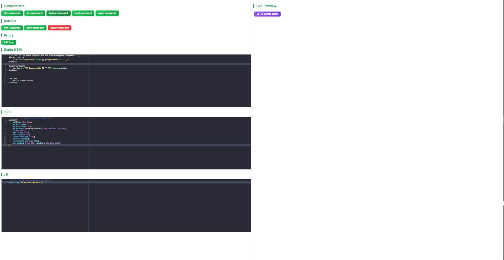
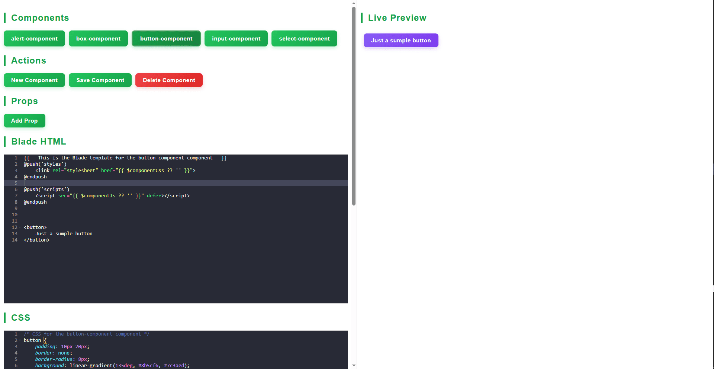

# Blade Component Previewer

<!-- TOC -->
## Contents
- [Blade Component Previewer](#blade-component-previewer)
  - [Contents](#contents)
    - [Image one:](#image-one)
    - [Image two:](#image-two)
  - [Features](#features)
  - [Installation](#installation)
  - [Usage](#usage)
  - [Configuration](#configuration)
  - [License](#license)
<!-- /TOC -->

A Laravel package for visually creating, editing, and previewing Blade components with live editing of Blade, CSS, and JS.

### Image one:


### Image two:


## Features

- List all available Blade components
- Create new components (Blade, CSS, JS, PHP class)
- Edit component Blade, CSS, and JS in the browser
- Live preview with custom props
- Delete components
- Simple, self-contained UI

## Installation

> **Note:**  
> This package uses 'Ace Editor (AceJS)' for in-browser code editing. No extra installation is required, as 'AceJS' is bundled with the package UI.  
>  
> **Requirements:**  
> - PHP >= 8.0  
> - Laravel >= 8.0  
> - Composer

1. **Require the package via Composer:**

    ```sh
    composer require h1ch4m/blade-component-previewer --dev
    ```

2. **Publish the config (optional):**

    ```sh
    php artisan vendor:publish --provider="H1ch4m\BladeComponentPreviewer\BladeComponentPreviewerServiceProvider"
    ```

3. **Access the previewer:**

    Visit `/blade-component-previewer` in your browser (while your dev server is running).

## Usage

- **Create a new component:**  
  Click "New Component", enter a name (e.g., `ButtonComponent`), and start editing.  
  When you create a new component, the following files will be generated automatically (the paths based on config file):
  - Blade view file (`resources/views/components/{name}.blade.php`).
  - CSS file (`public/css/components/{name}.css`).
  - JS file (`public/js/components/{name}.js`).
  - PHP class (`app/View/Components/BladeComponentPreviewer/{Name}.php`).

- **Edit Blade, CSS, JS:**  
  Use the in-browser editors to modify your component files.

- **Preview:**  
  The preview updates live as you edit.

- **Props:**  
  Add and edit props to test your component with different data, and those props will added as params in your component class.

- **Save/Delete:**  
  Use the "Save" and "Delete" buttons to persist or remove components.

## Configuration

You can customize paths and namespaces in `config/blade-component-previewer.php`:

```php
return [
    'bladePath' => 'components',      // Blade views directory
    'cssPath' => 'css/components',    // Public CSS directory
    'jsPath' => 'js/components',      // Public JS directory
    'classNamespace' => 'App\\View\\Components\\BladeComponentPreviewer',
    'classPath' => 'View/Components/BladeComponentPreviewer',
];
```

## License

This package is open-sourced software licensed under the [MIT license](LICENSE).